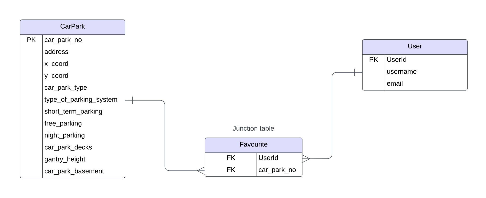

# Carpark-Info Assignment

This project implements a carpark management system using **.NET 6.0, SQLite with Entity Framework Core**, and follows best coding practices to create a robust, maintainable, and extensible solution. It processes daily delta CSV files, stores the data in a normalized database schema, and provides APIs to fulfill user stories such as filtering carparks and managing user favorites.

## Key Features
* **Batch Job**: Processes a daily delta CSV file using CsvReader. The job performs bulk inserts/updates with rollback in case of errors.
* **Normalized Database Design**: Applies 1NF, 2NF, and 3NF to ensure flexibility, scalability, and referential integrity.
* **User Stories**: Implements APIs to:
        Filter carparks by criteria (free parking, night parking, height requirements).
        Add favorite carparks for users.
* **Extensible Architecture**: Supports changes such as switching the data access technology or interface file format (e.g., CSV to JSON) using the repository pattern and unit of work. 
* **Swagger Documentation**: Detailed API documentation to assist frontend developers.
* **Secure Coding Practices**: Implements validation and error handling
* **Unit Testing**: Code is designed for testability using the repository pattern and unit of work.
* **Performance and Query Optimization**: Handles large datasets using bulk operations and normalization reduces data dependency and redudancy.

## Getting Started

**Prerequisites:**

Ensure .NET 6.0 SDK is installed on the system

**Steps to run the application:**

* Clone this repository and navigate to the **CarPark-Info** folder.
* Run **dotnet restore** to restore dependencies. 
* Run **dotnet ef database update** to create the database. 
* Run **dotnet run** to run the application.
* Access Swagger for API documentation at: **https://localhost:7071/swagger** 

## Assignment Requirements & Solutions

### 1. Database Schema & Normalization

The schema includes three tables:

* **Carpark Table** : Stores carpark details with **car_park_no** as the primary key. The information processed from the csv file is fed into the CarPark table. 
* **Users Table** : Stores user information with **user_id** as the primary key. Manually populated for testing purposes. 
* **Favourites Table** : A junction table (representing the many to many relationship between Users and CarParks) with composite keys **(user_id, car_park_no)** to link users with multiple favorite carparks. This assumes that multiple users can favourite the same carpark.

Advantages of having a seperate junction table to store the favourites instead of a favourites column in the Users or CarPark table:

* **Flexibility**: Users can select multiple favorite carparks.
* **Scalability**: Avoids adding multiple columns for favorites, which would limit options.
* **Referential Integrity**: Ensures valid relationships between users and carparks.

This data schema adheres to **1NF, 2NF, and 3NF normalization techniques**, ensuring atomic data entries, eliminating partial dependencies, and avoiding transitive dependencies. This design improves performance by reducing redundancy, enhancing scalability, and maintaining data integrity with a well-structured and efficient schema.

#### ER diagram

### 2. Batch job design

* **File Processing**: ProcessCsvService.cs in the Services folder parses the daily delta CSV file using the **CsvHelper** library and processes the records into the CarPark table. 
* **Delta Logic**: Checks for existing records to update; otherwise, inserts new ones using the **BulkInsertOrUpdate function of EFCore.BulkExtensions**. 
* **Error Handling**: Implements rollback for the entire file in case of errors by treating it as a single transaction. 
* **Performance**: Uses bulk insert/update operations for efficiency.

### 3. API Implementation

#### POST Add Favourite

**URL: /api/AddFavourite/{user_id}/{carpark_no}**

This API allows users to favourite a carpark and assumes that multiple users can favourite the same carpark. By providing the user_id and carpark_no as route parameters, the API links the specified user to the carpark in the Favourites Table, signifying that the user has favorited the carpark. This intuitive design simplifies integration for developers by avoiding the need to construct complex request bodies.

### GET Filter Carparks

This API provides three methods to filter carparks based on specific user requirements:

* **Free Parking**: Returns carparks offering free parking.
* **Night Parking**: Returns carparks allowing night parking.
* **Height Requirements**: Filters carparks that meet the specified vehicle height requirement.

Each filter operation leverages methods defined in the Carpark Repository, ensuring efficient and reusable query logic to retrieve data from the database.

#### GET All Entities (For Testing)

To support development and testing, additional GET methods are provided to retrieve all records from each of the three database tables:

* Users Table: Fetches all user details.
* Carpark Table: Fetches all carpark details.
* Favourites Table: Fetches all favourite details (users to carpark relationship).

  
These methods enable developers to verify the data stored in the database and test the functionality of the implemented features.

#### Swagger Documentation

All API endpoints are documented using Swagger, accessible at the /swagger endpoint (https://localhost:7071/swagger). This interactive documentation allows developers to explore, test, and validate the APIs directly in their browser, enhancing usability and ensuring the project functionalities are easy to test and integrate.

### 4. Architecture and Design implementations:

#### Repository Pattern

The Repository Pattern is used to abstract the data access layer, providing a clean separation between the application logic and the database operations. This design enables:

* **Extensibility**: By abstracting the data access logic, the codebase can easily switch to another ORM or data access technology (e.g., from Entity Framework to Dapper).
* **Testability**: Simplifies unit testing by mocking the repository layer.
* **Reusability** : Centralizes data access logic, ensuring consistent implementation across the project.

  
We have implemented an **IGeneric interface that defines all common CRUD operations**, such as GetAllAsync(), FilterAsync(), AddAsync(), UpdateAsync(), RemoveAsync() and SaveAsync().

Additionally, IGeneric includes a filter operation, but its implementation is specific to the Carpark Table, which is why:

A **dedicated ICarparkRepository interface defines specific filtering methods** such as OffersFreeParking, NightParking, and MeetHeightRequirement.

These methods are implemented in CarparkRepository.cs, making the design scalable and expandable. For example, similar interfaces and repository implementations can be added to include more filters for carparks or other entities as per future requirements.

#### Unit of Work

The Unit of Work design pattern is implemented to manage multiple repositories and handle changes as a single transaction. This ensures:

* **Transactional Consistency**: All operations within a transaction are committed together or rolled back in case of an error, maintaining data integrity.
* **Abstraction**: By encapsulating transaction methods and bulk operations within the Unit of Work, the service layer remains decoupled from DbContext.

The transaction methods and Bulk Upsert Methods are defined and implemented in the UnitOfWork files, ensuring a centralized approach for managing database interactions and facilitating scalability for future enhancements.

This layered architecture ensures that each component focuses on a specific responsibility (**Seperation of Concerns**), making the application maintainable, extensible, and testable.

